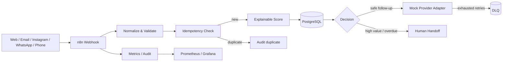

# 01 — Omnichannel Lead Recovery & SLA Engine

An importable, zero-cost reference system for capturing leads from multiple channels, normalizing them into one contract, preventing duplicates, prioritizing follow-up, monitoring response SLAs, and escalating high-value or overdue leads to a human owner.

## Business problem

Small service businesses often receive inquiries through forms, email, social messages, phone notes, and messaging apps. Leads are lost when channels are checked inconsistently, duplicates create conflicting follow-ups, or nobody owns the response deadline.

This project treats lead recovery as a stateful reliability problem—not as bulk messaging.

## What is implemented

- one canonical lead-event contract for `web`, `email`, `instagram`, `whatsapp`, and `phone`;
- deterministic normalization and explainable lead scoring;
- stable idempotency keys and database uniqueness constraints;
- importable n8n intake and asynchronous retry/DLQ workflows;
- PostgreSQL schema for leads, events, follow-ups, audit history, and DLQ;
- retry-aware local mock provider with controllable failure injection;
- SLA classification and human-handoff decisions;
- Prometheus metrics endpoint and Grafana provisioning;
- synthetic seed data and sample requests;
- automated tests for core logic, HTTP behavior, workflow integrity, duplicates, invalid input, and provider failures.

## Architecture



More detail: [Architecture](docs/architecture.md) and [Data Flow](docs/data-flow.md).

## Zero-cost local stack

| Component | Purpose |
|---|---|
| n8n Community | orchestration and importable workflow |
| PostgreSQL | durable lead state, audit events, idempotency, and DLQ |
| Redis | n8n queue backend and future short-lived locks |
| Mock Provider | deterministic WhatsApp/email/social delivery simulation |
| Prometheus | metric collection |
| Grafana OSS | local dashboard |
| Mailpit | local email inspection |

No payment card or paid API is required.

## Start

```bash
cp .env.example .env
docker compose up --build
```

Open:

- n8n: `http://localhost:5678`
- Mock provider health: `http://localhost:8080/health`
- Prometheus: `http://localhost:9090`
- Grafana: `http://localhost:3000`
- Mailpit: `http://localhost:8025`

Import both JSON files from `workflows/` into n8n and select the local PostgreSQL credential described in [Setup](docs/setup.md).

## Example request

```bash
curl -X POST http://localhost:5678/webhook/lead-intake \
  -H 'content-type: application/json' \
  -H 'x-webhook-secret: local-demo-secret' \
  -d @examples/valid-web-lead.json
```

Example decision:

```json
{
  "status": "accepted",
  "priority": "high",
  "score": 82,
  "slaMinutes": 15,
  "humanHandoff": true,
  "evidence": "simulated"
}
```

## Tests

From the repository root:

```bash
npm run check
```

The tests are deterministic and require no network access. Docker Compose is additionally validated by GitHub Actions.

## Evidence boundary

The provider deliveries and KPI examples are simulated. This repository does **not** claim real Instagram, WhatsApp, revenue, or customer-production evidence. Real provider adapters require platform approval, credentials, consent rules, and environment-specific security review.

## Documentation

- [Setup](docs/setup.md)
- [Architecture](docs/architecture.md)
- [Data Flow](docs/data-flow.md)
- [Data Contract](docs/data-contract.md)
- [Test Plan](docs/test-plan.md)
- [Failure Scenarios](docs/failure-scenarios.md)
- [Threat Model](docs/threat-model.md)
- [KPI & Cost](docs/kpi-and-cost.md)
- [Known Limitations](docs/known-limitations.md)
- [Production Readiness](docs/production-readiness.md)
