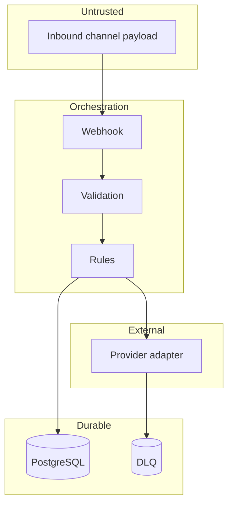

# Architecture

## Boundaries

The n8n workflow coordinates intake and persistence. Deterministic lead rules are duplicated as a dependency-free reference module for tests and review. PostgreSQL is the source of truth. External delivery is behind a provider boundary and defaults to a local mock.

## Decisions

1. **Stable provider event identity:** `sha256(channel:sourceEventId)` prevents replayed webhooks from creating multiple leads.
2. **Explainable score:** fixed weighted rules are used instead of an opaque model in Project 01.
3. **Human handoff:** emergencies, high scores, and overdue leads are not sent through an unsafe autonomous path.
4. **Consent boundary:** the system does not auto-follow-up without explicit `consentToContact`.
5. **Durable audit:** events and decisions are stored separately from current lead state.
6. **Provider isolation:** mock and future real adapters share a message contract.

## Trust zones

Production deployment requires TLS, authenticated callbacks, a secret manager, restricted network policies, backups, and load evidence; none is implied by the local compose stack.

