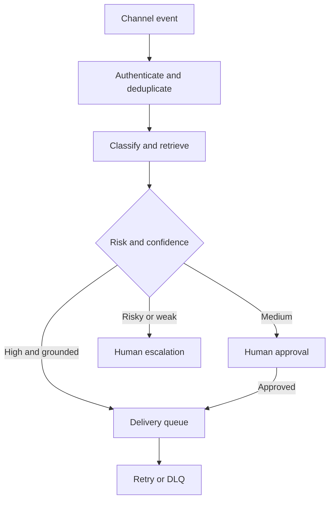

# Project 02 — AI Customer Support Command Center

An auditable, zero-cost-first support system that accepts tickets from four channels, removes sensitive data, classifies and retrieves local knowledge, routes uncertain or risky cases to people, and delivers approved responses with bounded retry and a dead-letter queue.

## Business problem

Support requests arrive in disconnected inboxes. Duplicate events, inconsistent answers, missed SLAs, unsafe automatic replies, and missing audit evidence increase cost and risk. This project treats support as a lifecycle with ownership and controls—not as a chatbot demo.

## Implemented system

- Email, WhatsApp, Instagram, and Web Chat canonical contract.
- Stable provider-event idempotency and PostgreSQL uniqueness.
- Deterministic explainable classification and local lexical RAG; no paid API.
- PII redaction before draft creation.
- Confidence, grounding, sensitivity, and urgency routing.
- Explicit human approval or rejection with reviewer audit.
- Local delivery adapter, rate-limit simulation, exponential backoff, three-attempt cap, and DLQ.
- Prometheus metrics and a provisioned Grafana dashboard.
- Automated core, HTTP, workflow-structure, JSON, secret-pattern, and Compose validation.



## Quick validation

```bash
npm test
```

## Local demonstration

```bash
cp .env.example .env
docker compose up --build
```

Import the three JSON files from `workflows/` into n8n, create the documented local PostgreSQL credential, activate them, and call the intake webhook with an example payload and `x-webhook-secret`.

## Evidence boundary

All included classification, delivery, cost, and KPI evidence is generated from deterministic fixtures and is labelled `simulated`. The repository demonstrates engineering controls; it does not claim real customer operation, provider delivery, or production SLA history.

## Documentation

- [Setup](docs/setup.md) · [Architecture](docs/architecture.md) · [Data flow](docs/data-flow.md)
- [Data contract](docs/data-contract.md) · [Test plan](docs/test-plan.md) · [Failure scenarios](docs/failure-scenarios.md)
- [Threat model](docs/threat-model.md) · [KPI and cost](docs/kpi-and-cost.md) · [Known limitations](docs/known-limitations.md)
- [Production readiness](docs/production-readiness.md) · [Sample I/O](docs/sample-input-output.md) · [Interview defense](docs/interview-defense.md)
