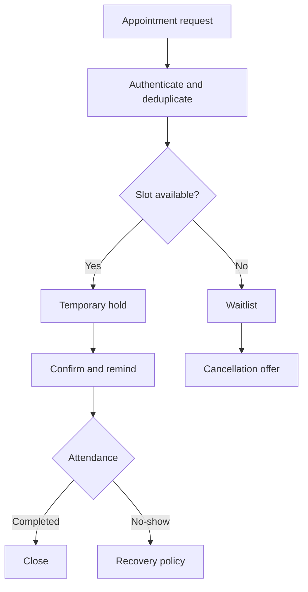

# Project 03 — Appointment & No-Show Recovery Engine

A zero-cost-first scheduling system that protects resource calendars from double booking, sends consented reminders, fills cancellations from a deterministic waitlist, records attendance evidence, and measures recovered revenue only after a rebooked appointment is completed.

## Business problem

Manual booking creates race conditions, forgotten appointments, unused cancelled slots, uncontrolled reminder spam, and inflated claims about recovered revenue. This project models appointments as durable state with calendar locks, expiring holds, explicit attendance evidence, fair waitlist ranking, bounded delivery retry, and auditable recovery policy.

## Implemented

- Four-channel canonical appointment contract and stable event idempotency.
- PostgreSQL exclusion constraint preventing overlapping active bookings per resource.
- Five-minute slot holds, insufficient-lead-time review, and conflict-to-waitlist routing.
- Consent-aware 24-hour and 2-hour reminder schedule.
- Priority-then-FIFO waitlist selection with expiring offers.
- Attendance recorded by an identified actor before no-show recovery.
- Seven-day recovery cooldown, one-offer cap in the core policy, opt-out protection, and simulated evidence labels.
- Revenue counted only after a rebooked appointment is completed.
- Bounded delivery retries, backoff, DLQ, metrics, dashboard, tests, and CI.



## Validation

```bash
npm test
```

## Local stack

```bash
cp .env.example .env
docker compose up --build
```

Import the four workflow JSON files into n8n and create the local PostgreSQL credential described in [setup](docs/setup.md). No paid API, card, or external account is required.

## Evidence boundary

Calendar/provider delivery, attendance, recovered revenue, and business KPI examples are `simulated`. The repository demonstrates production-oriented engineering controls; it does not claim real customer operation or production SLO history.

## Documentation

[Setup](docs/setup.md) · [Architecture](docs/architecture.md) · [Data flow](docs/data-flow.md) · [Data contract](docs/data-contract.md) · [Test plan](docs/test-plan.md) · [Failure scenarios](docs/failure-scenarios.md) · [Threat model](docs/threat-model.md) · [KPI and cost](docs/kpi-and-cost.md) · [Known limitations](docs/known-limitations.md) · [Production readiness](docs/production-readiness.md) · [Sample I/O](docs/sample-input-output.md) · [Interview defense](docs/interview-defense.md)
