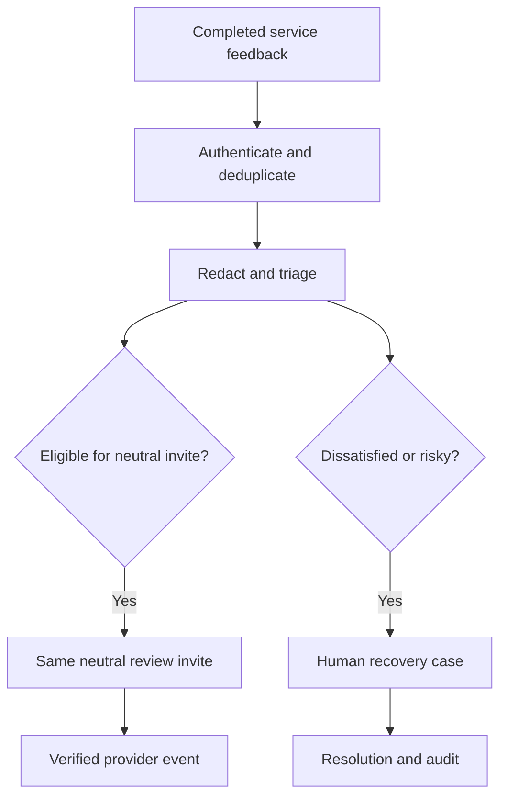

# Project 04 — Review & Reputation Recovery System

A zero-cost-first, policy-aware reputation system that collects post-service feedback, opens human recovery cases for dissatisfaction or risk, sends the same neutral public-review invitation to every eligible customer, and counts only verified provider review events.

## Business problem

Businesses need to detect service failures and recover customer trust without manipulating public reviews. Naive automations often create review gating: satisfied customers get a public link while dissatisfied customers are diverted to a private form. This project explicitly prohibits that pattern. Recovery and public-review eligibility are independent decisions.

## Implemented

- Versioned four-channel feedback contract, event idempotency, and PII redaction.
- Deterministic sentiment/risk triage used only for recovery priority—not public-review suppression.
- Neutral invitation policy based on service completion, opt-out, prior verified review, and 30-day cooldown.
- Negative feedback can receive both the same neutral invite and a human-owned recovery case.
- High-risk safety/legal/fraud signals escalate to people with a shorter SLA.
- Human recovery action requires actor identity and resolution code with audit evidence.
- Verified review metrics require a provider event ID; clicks and drafts are not counted as reviews.
- Bounded delivery retry, backoff, DLQ, Prometheus, Grafana, tests, CI, and complete documentation.
- No incentives, rating-specific links, sentiment-based suppression, or paid service dependencies.



## Validation

```bash
npm test
```

## Local stack

```bash
cp .env.example .env
docker compose up --build
```

Import the four workflows and create the local PostgreSQL credential documented in [setup](docs/setup.md). No paid API, card, external review account, or messaging provider is required for the default path.

## Evidence boundary

Sentiment, delivery, provider reviews, recovery outcomes, and KPI examples are `simulated` unless explicitly ingested as `provider_verified`. The repository demonstrates production-oriented policy and reliability controls; it does not claim real customer operation or improved public ratings.

## Documentation

[Setup](docs/setup.md) · [Architecture](docs/architecture.md) · [Data flow](docs/data-flow.md) · [Data contract](docs/data-contract.md) · [Test plan](docs/test-plan.md) · [Failure scenarios](docs/failure-scenarios.md) · [Threat model](docs/threat-model.md) · [KPI and cost](docs/kpi-and-cost.md) · [Known limitations](docs/known-limitations.md) · [Production readiness](docs/production-readiness.md) · [Sample I/O](docs/sample-input-output.md) · [Interview defense](docs/interview-defense.md)
