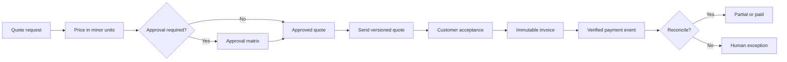

# Project 05 — Quote-to-Cash Automation

A zero-cost-first reference system that converts a quote request into a versioned price, approval decision, customer acceptance, immutable invoice, verified payment event, and reconciliation outcome without pretending that a simulated payment is real cash.

## Business problem

Quote-to-cash breaks when prices are edited without versions, discounts bypass approval, stale quotes are accepted, invoices drift from accepted terms, payment webhooks replay, or unmatched money is silently marked paid. This project makes those state and evidence boundaries explicit.

## Implemented

- Versioned quote request contract and durable event idempotency.
- Integer minor-unit money arithmetic; no floating-point currency.
- Deterministic totals, discount allocation, line tax, and overflow protection.
- Approval matrix for discount, high-value, and executive thresholds.
- Identified approver, role-specific decisions, rejection, and audit.
- Customer acceptance bound to the exact quote version and validity window.
- Invoice generation only after acceptance; accepted amount and currency are frozen.
- Provider-scoped payment identity, verified evidence label, atomic reconciliation, partial payment, and duplicate suppression.
- Currency, invoice, invalid amount, and overpayment exceptions route to human review.
- Bounded document delivery retry, backoff, DLQ, monitoring, tests, CI, and documentation.
- No paid API, card, payment processor, or external accounting account required.



## Validation

```bash
npm test
```

## Local stack

```bash
cp .env.example .env
docker compose up --build
```

Import all six workflows and create the `Local Quote Postgres` credential described in [setup](docs/setup.md).

## Evidence boundary

Pricing and policy results are deterministic. Delivery, customer acceptance, provider payment, cash collection, accounting posting, tax compliance, and KPI examples remain simulated unless a real signed provider/customer event is integrated. This is production-oriented, not a claim of real financial operation.

## Documentation

[Setup](docs/setup.md) · [Architecture](docs/architecture.md) · [Data flow](docs/data-flow.md) · [Data contract](docs/data-contract.md) · [State machine](docs/state-machine.md) · [Test plan](docs/test-plan.md) · [Failure scenarios](docs/failure-scenarios.md) · [Threat model](docs/threat-model.md) · [KPI and cost](docs/kpi-and-cost.md) · [Known limitations](docs/known-limitations.md) · [Production readiness](docs/production-readiness.md) · [Sample I/O](docs/sample-input-output.md) · [Interview defense](docs/interview-defense.md)
