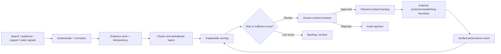

# Project 06 — AI Content Intelligence Engine

A zero-cost-first, production-oriented system that turns audience, search, support, sales, competitor, and trend signals into an evidence-backed content backlog. It does not generate or publish content automatically: it prioritizes what is worth creating and preserves human ownership of sensitive decisions.

## Business problem

Content teams often choose topics from intuition, copy noisy trends, lose source provenance, confuse synthetic engagement with real performance, and let generated text bypass brand or safety review. This project creates a controlled research-to-backlog loop with deduplication, explainable scoring, evidence labels, approval, feedback, and audit.

## Implemented

- Versioned signal contract for six source types and durable source-scoped idempotency.
- URL protocol validation, bounded text, source provenance, and `simulated` versus `source_verified` evidence.
- Deterministic topic canonicalization, similarity-based deduplication, and evidence merging.
- Explainable 100-point score: demand, brand fit, evidence quality, freshness, business alignment, and risk penalty.
- Prompt-injection text is treated as untrusted data; sensitive and excluded themes cannot silently enter production.
- Human reviewer identity and role are required before approval or rejection.
- Controlled topic state machine and one-time backlog promotion.
- Authenticated performance events with impossible-funnel rejection and verified-only KPI calculations.
- Bounded delivery retry, exponential backoff, DLQ, audit log, metrics, tests, CI, and documentation.
- No paid API, card, social account, scraping service, or language-model key is required.



## Validation

```bash
npm test
```

## Local stack

```bash
cp .env.example .env
docker compose up --build
```

Import all six workflows and create the `Local Content Postgres` credential described in [setup](docs/setup.md).

## Evidence boundary

Normalization, scoring, state rules, funnel validation, and local tests are executable. Example sources, engagement, publishing, and business results are simulated. The default system does not scrape live platforms, call a model, or claim revenue. Real connectors must comply with provider terms and label their signed or source-verified evidence.

## Documentation

[Setup](docs/setup.md) · [Architecture](docs/architecture.md) · [Data flow](docs/data-flow.md) · [Data contract](docs/data-contract.md) · [Scoring model](docs/scoring-model.md) · [State machine](docs/state-machine.md) · [Test plan](docs/test-plan.md) · [Failure scenarios](docs/failure-scenarios.md) · [Threat model](docs/threat-model.md) · [KPI and cost](docs/kpi-and-cost.md) · [Known limitations](docs/known-limitations.md) · [Production readiness](docs/production-readiness.md) · [Sample I/O](docs/sample-input-output.md) · [Interview defense](docs/interview-defense.md)
