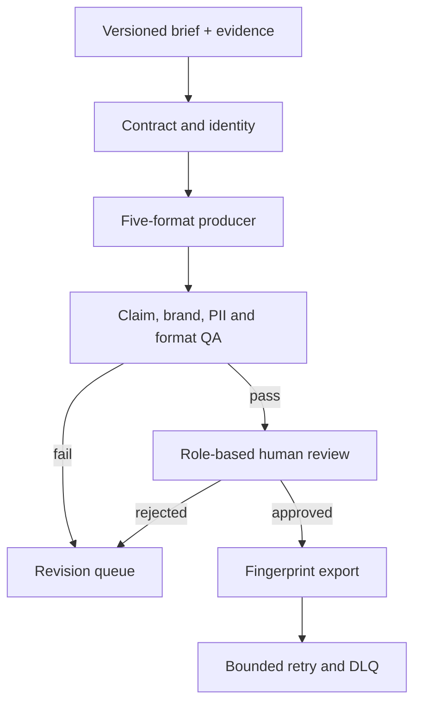

# Project 07 — Multi-Format Content Production Studio

A production-oriented, evidence-aware content system that turns one versioned brief into five governed content contracts: article, Reel script, carousel, email, and short-video script. The default implementation is deterministic and runs locally without a paid API.

## Business problem

Content teams often copy one prompt into several tools, lose the source behind factual claims, drift away from brand rules, and publish without a reproducible approval trail. This project treats content as a versioned package with evidence, QA, human ownership, and an immutable export manifest.

## Architecture



PostgreSQL is the system of record; n8n coordinates the flow; the local Node.js engine performs deterministic production and policy checks. Prometheus and Grafana expose operational metrics.

## What is implemented

- six importable, inactive-by-default n8n workflows;
- JSON Schema for the content brief and a versioned brand-memory fixture;
- five explicit output contracts with accessible visual briefs;
- evidence-to-claim ledger and prompt-injection, PII, brand and format checks;
- package state machine and role-specific approval matrix;
- idempotent writes, immutable SHA-256 fingerprints, retry and DLQ evidence;
- local mock delivery, sample inputs, failure fixtures, tests and monitoring;
- no required credit card, paid API, cloud account, or external LLM.

## Quick start

```bash
cp .env.example .env
docker compose up --build
curl http://localhost:8087/health
```

Or run only the free local engine:

```bash
npm test
node src/server.mjs
```

Import the JSON files in `workflows/` into n8n, replace the placeholder PostgreSQL credential, and keep every workflow inactive until secrets and URLs are configured.

## Data flow and states

`generated -> qa_failed -> generated` handles revision. A passing package follows `generated -> needs_review -> approved -> export_ready -> released`; a reviewer can instead send it to `rejected`. Released and rejected versions are terminal, so a correction creates a new version.

The brief, evidence rows, variants, claim ledger, QA findings, reviewer decisions, export manifest, delivery attempts, DLQ events, and audit events are stored separately. This makes “what was generated, from which evidence, under which brand version, and who approved it?” answerable.

## Test evidence

Run from this directory:

```bash
npm test
```

The test suite covers input validation, unsafe URLs, duplicate identities, claim grounding, prompt injection in evidence, five-format generation, deterministic fingerprints, brand-version mismatch, format QA, PII, sensitive claims, approval roles, state transitions, export integrity, bounded retry, API behavior, workflow connectivity, and persistence coverage.

## Evidence boundary

Generated examples and KPI fixtures are labelled `simulated-output`. `provider_verified` is required before a release is counted as a real provider delivery. This repository does not claim real audience growth, revenue, or conversion from synthetic fixtures.

## Documentation

- [Architecture and data flow](docs/architecture.md)
- [Contracts and examples](docs/contracts.md)
- [Testing and failure scenarios](docs/testing.md)
- [Security and threat model](docs/security.md)
- [KPI, cost, limitations, readiness and interview notes](docs/operations-and-interview.md)

## Known limitation

The local producer proves orchestration, contracts, controls and reproducibility—not creative quality from a live model. Real publishing adapters, licensed media generation, provider OAuth, legal review policy and audience KPI validation remain environment-specific integrations.
