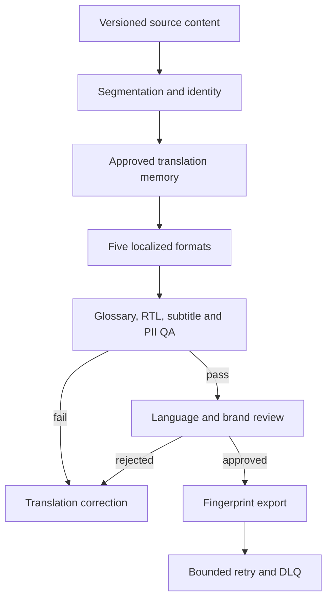

# Project 08 — Content Repurposing & Localization Factory

A production-oriented system that converts one versioned source artifact into five governed formats across Persian and Spanish, using approved translation memory, terminology rules, RTL/LTR metadata, subtitle checks, human review, immutable export evidence, and a completely free local path.

## Business problem

Copying content into a generic translator loses approved terminology, claim context, brand voice, subtitle timing, right-to-left metadata, and evidence of who reviewed which version. This project treats localization as a controlled engineering lifecycle rather than an untracked text-generation step.

## Architecture



## Implemented evidence

- six importable, inactive-by-default n8n workflows;
- source-content JSON Schema, locale profiles, versioned glossary and translation memory;
- Persian RTL and Spanish LTR output for article, social post, email, SRT subtitles and carousel copy;
- fail-closed missing-translation marker instead of fabricated translation;
- checks for prompt injection, PII, glossary violations, direction metadata, subtitle overlap/read speed and alt text;
- language, brand and conditional cultural review roles scoped to an immutable version;
- PostgreSQL lifecycle schema, SHA-256 manifests, retry, DLQ, audit and monitoring;
- deterministic tests and local delivery simulation with no paid API or account.

## Quick start

```bash
cp .env.example .env
docker compose up --build
curl http://localhost:8088/health
```

Or run the engine tests without Docker:

```bash
npm test
node src/server.mjs
```

Import `workflows/*.json` into n8n and replace every credential placeholder before activation.

## State model

`localized -> qa_failed -> localized` supports correction. A passing job follows `localized -> needs_review -> approved -> export_ready -> released`; rejection is terminal for that version.

## Evidence boundary

Approved exact-memory entries produce the deterministic sample. Unknown text is marked `NEEDS_TRANSLATION` and blocked by QA. Fixtures and mock delivery do not prove live-provider reach, conversion, revenue, or professional translation quality.

## Documentation

- [Architecture and data flow](docs/architecture.md)
- [Contracts, formats and terminology](docs/contracts.md)
- [Testing and failure injection](docs/testing.md)
- [Security and cultural risk](docs/security.md)
- [Operations, limitations and interview defense](docs/operations-and-interview.md)

## Known limitations

The reference implementation is not a universal machine translator. It proves versioning, memory reuse, safe fallback, format generation, QA, review and audit. Production deployment still needs professional translators, provider adapters, OAuth/RBAC, locale-specific legal review, load/SLO evidence and measured business KPIs.
