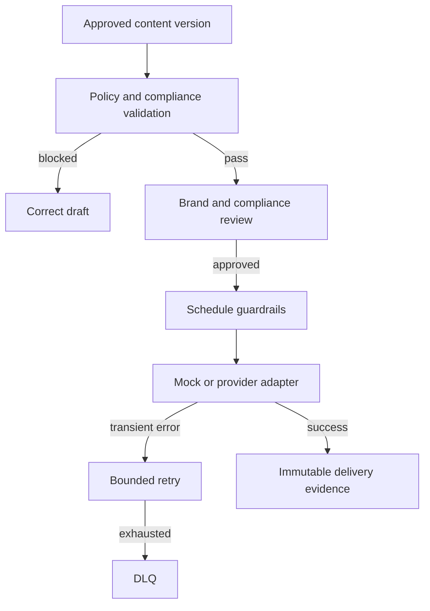

# Project 09 — Social Publishing & Governance System

A production-oriented, zero-cost reference system for governed multi-channel social publishing. It turns an approved content version into an auditable publication record with policy validation, role-based approval, scheduling guardrails, bounded delivery retry, DLQ and evidence-aware metrics.

## Business problem

Publishing is not merely sending a caption to a social platform. Teams lose control when an outdated asset is posted, an approval cannot be proved, disclosure is absent, a rate limit is ignored, a regulated claim bypasses review, or a delivery failure silently disappears. This project models publishing as a stateful, reviewable release process.

## Architecture



## What is implemented

- channel policies for Instagram, LinkedIn, Facebook and X;
- immutable content/asset version identity, UTM attribution and audit history;
- consent, disclosure, PII, prompt-injection, prohibited claim and targeting checks;
- brand approval, plus compliance approval for regulated claims;
- re-scheduling that invalidates earlier approvals and forces re-review;
- per-channel scheduling interval guardrails, bounded retry and DLQ classification;
- inactive-by-default n8n workflow JSON, PostgreSQL schema, Prometheus scrape configuration and mock-only local server;
- deterministic Node.js tests with no paid API, account, secret or live social post.

## Quick start

```bash
cd 09-social-publishing-governance-system
npm test
node src/server.mjs
curl http://localhost:8089/health
```

Validate a sample locally:

```bash
curl -X POST http://localhost:8089/publications/validate \
  -H 'content-type: application/json' \
  --data @examples/approved-linkedin-post.json
```

`docker compose up --build` is also available. Import `workflows/*.json` into n8n only after replacing credential placeholders. All workflows are inactive by default.

## State model

`draft -> policy_checked -> needs_review -> approved -> scheduled -> publishing -> published`

Policy failure leads to rejection/correction. Temporary provider failures can enter `retrying`; terminal provider failures or exhausted attempts enter `dlq`. A schedule change returns the item to `draft`, increments its revision and removes former approvals.

## Evidence boundary

The default adapter is a deterministic simulation. It proves policy controls, state transitions, scheduling, retry/DLQ and audit evidence; it does **not** prove real OAuth access, a real social post, impressions, conversions, revenue or platform compliance approval.

## Documentation

- [Architecture and data flow](docs/architecture.md)
- [Data contract and policy model](docs/contracts.md)
- [Testing and failure injection](docs/testing.md)
- [Security, governance and operational limits](docs/security-and-operations.md)

## Known limitations

Production use still needs provider OAuth adapters, encrypted secret management, platform-specific policy/legal review, asset malware scanning, RBAC/SSO, a real queue, database migrations, alert routing, load/SLO evidence and observed provider delivery metrics.
