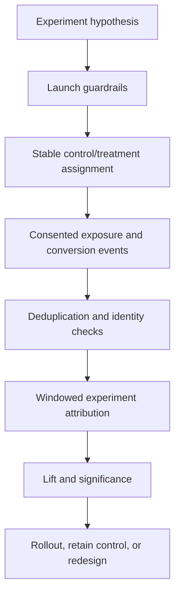

# Project 10 — Content Experimentation & Revenue Attribution

A production-oriented, zero-cost reference system for testing two governed content variants and measuring the primary outcome without turning clicks, impressions, or fixture data into fabricated revenue claims.

## Business problem

Teams often call a post “successful” because it received likes or clicks. That is not causal evidence. A credible content decision needs a written hypothesis, a control and treatment, stable assignment, consented identity, a conversion definition, a time window, deduplicated events, and an attribution rule.

## Architecture



## Implemented evidence

- two-variant experiment contract with one explicit control and immutable content/asset versions;
- deterministic participant assignment, overlap guardrail and minimum sample guardrail;
- consented exposure, click and conversion events with provider-scoped event identity;
- conversion window, exposure requirement, variant identity matching and event deduplication;
- conversion rate, treatment lift, two-proportion z test, and an explicit insufficient-evidence outcome;
- provider-verified revenue counted only when the conversion event is verified and has integer minor-unit value;
- inactive-by-default n8n workflows, PostgreSQL schema, tests, sample data, monitoring config and mock-only local server.

## Quick start

```bash
cd 10-content-experimentation-revenue-attribution
npm test
node src/server.mjs
curl http://localhost:8090/health
```

## Evidence boundary

Sample events are simulated. They prove contract validation, deterministic assignment, attribution rules and analysis code; they do not prove real platform impressions, a live customer conversion, CAC, ROAS, revenue, or causal impact outside the experiment design.

## Documentation

- [Architecture and data flow](docs/architecture.md)
- [Experiment and data contracts](docs/contracts.md)
- [Testing and failure injection](docs/testing.md)
- [Security, privacy and operations](docs/security-and-operations.md)

## Known limitations

The reference uses a two-variant fixed-horizon comparison. Production use needs a consent management platform, server-side event collection, identity resolution policy, bot/fraud filtering, sequential-testing policy, power analysis, external analytics adapters, secure secrets, retention controls and legal review.
