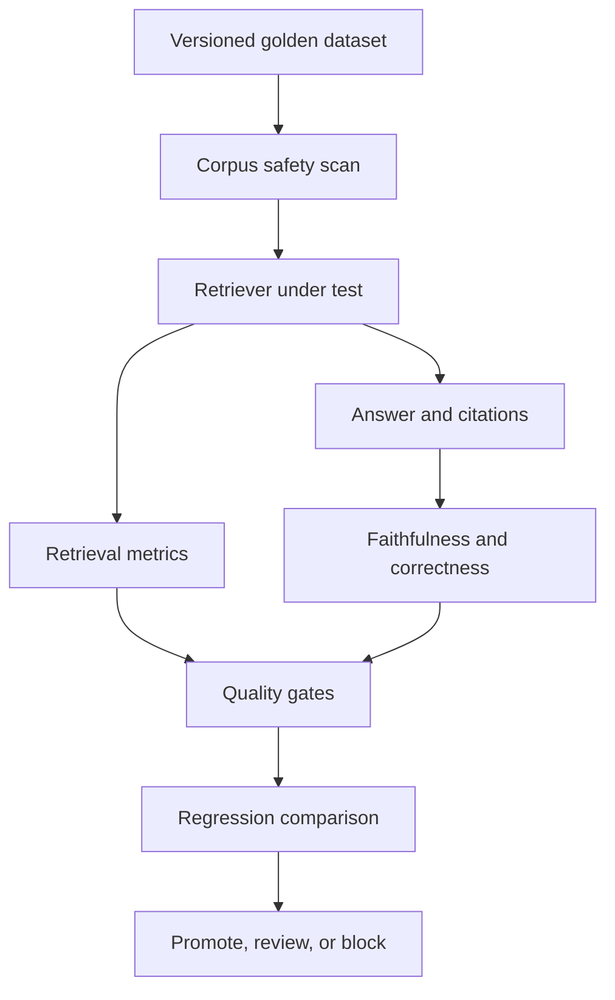

# Project 11 — Enterprise RAG Evaluation Platform

A production-oriented, zero-cost evaluation harness for measuring retrieval quality, answer grounding, citation integrity, safety findings, and regressions before a RAG release is promoted.

## Business problem

A RAG demo can look convincing while retrieving the wrong sources, omitting required facts, citing irrelevant documents, or silently degrading after a prompt, corpus, embedding, or retriever change. This project turns those risks into versioned test cases, deterministic metrics, release gates, and auditable reports.

## Architecture



## Implemented evidence

- versioned document and evaluation-case contracts with golden relevant documents and expected facts;
- deterministic zero-cost lexical retriever used as a replaceable local adapter;
- Precision@K, Recall@K, MRR and nDCG@K retrieval metrics;
- claim-level faithfulness, citation accuracy and expected-fact answer correctness;
- retrieval prompt-injection blocking before evaluation;
- aggregate quality gates and tolerance-based comparison with a checked-in baseline;
- four inactive-by-default n8n orchestration workflows;
- PostgreSQL audit schema, local HTTP service, executable CLI, fixtures and deterministic tests.

## Quick start

```bash
cd 11-enterprise-rag-evaluation-platform
npm test
npm run evaluate
node src/server.mjs
curl http://localhost:8110/health
```

The Docker path also uses only free local components:

```bash
cp .env.example .env
docker compose up --build
```

## Release decision

The default fixture requires perfect Recall@K, Faithfulness, Citation Accuracy and Answer Correctness. A candidate also fails when a metric drops more than the configured regression tolerance relative to the versioned baseline. Thresholds are policy choices and must be calibrated on a representative dataset before real deployment.

## Evidence boundary

The checked-in benchmark is synthetic and labelled `simulated`. It proves metric calculations, safety blocking, regression detection, workflow shape and release-gate behavior. It does not prove live model quality, business impact, production latency, production cost, or performance on a customer corpus.

## Documentation

- [Architecture and data flow](docs/architecture.md)
- [Evaluation methodology](docs/evaluation-methodology.md)
- [Testing and failure injection](docs/testing.md)
- [Security and production readiness](docs/security-and-operations.md)

## Known limitations

The reference retriever is lexical, answer claims are structured inputs, and the safety scanner is intentionally small. Production use needs a representative human-reviewed golden set, embedding/vector adapters, model-judge calibration against human labels, multilingual and adversarial slices, access-control-aware retrieval, PII policy, tracing, cost/latency measurement, and periodic baseline governance.
