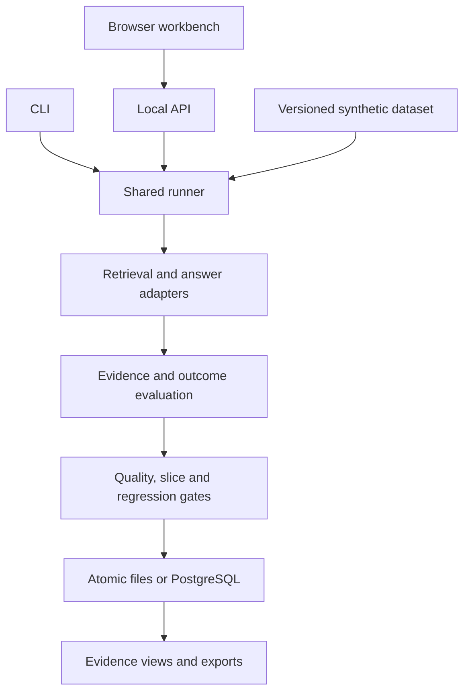

# Architecture

The browser, CLI and n8n references call one runner. HTTP accepts candidate configuration and an optional stored baseline ID, never arbitrary corpora, answer fixtures, thresholds, retrieval overrides or a safety-disable flag.

Documents and policy are server-owned in this local reference. The evaluated candidate sees authorized documents and the question, never expected fact IDs or expected outcomes. Gold IDs are consumed only by the metric engine. Fault injection is an explicit experimental configuration, not a hidden evaluator feature.

## Decisions

- Exact evidence attribution is named `quoteSupportRate`; it is not `faithfulness` or semantic entailment. Unknown paraphrases remain unverified.
- Runtime validation complements the descriptive schema. Cases must be unique at dataset scope. Rankings must contain unique authorized corpus IDs.
- Language and access-scope filters run before retrieval. Language matching is deliberate; this is bilingual evaluation, not cross-language retrieval.
- Small synthetic source conflict checks use authored topic/value metadata. No general natural-language contradiction detector is claimed.
- One shared policy owns thresholds, slice outcome minima and regression tolerance. Candidate API callers cannot override policy.
- Reports include exact dataset, policy and evaluator fingerprints. A baseline with incompatible metadata is rejected.
- The UI stores no privileged credentials in localStorage. Each process issues an ephemeral session token; local automation may use an environment-provided token.
- File persistence is the zero-dependency default; PostgreSQL is opt-in through `DATABASE_URL`. v2 reports include dataset version, and multiple dataset versions coexist.

## Adapter boundary

Ollama calls are loopback-only, bounded and non-redirecting. Their network path is separate from deterministic evaluation. Model-backed execution is labeled `local-model`; test stubs are never advertised as live model evidence. Judge outputs remain advisory even after calibration.
