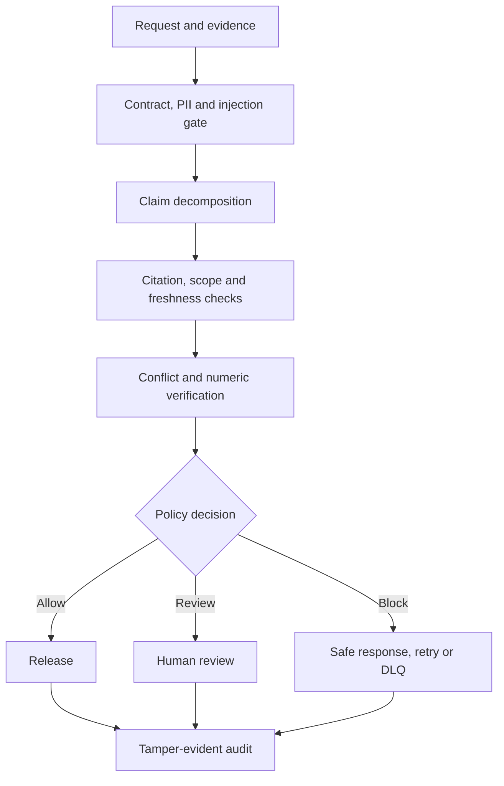

# Project 12 — AI Quality Assurance & Hallucination Firewall

A production-oriented, zero-cost verification gateway that checks an AI response before release and routes it to allow, safe abstention, human review, or block.

## Business problem

An AI answer can sound confident while using a fabricated citation, stale or unauthorized evidence, a conflicting source, or the wrong number and unit. In higher-risk domains, sending that answer directly to a user is unacceptable. This project converts the response into claim-level evidence checks, policy decisions, bounded recovery, and auditable evidence.

## Architecture



## Implemented evidence

- strict request, evidence and candidate normalization;
- domain-derived risk tiers for general, security/HR, and medical/legal/financial requests;
- prompt-injection, secret-pattern, payment-card-shaped PII and email detection;
- claim-level citation existence, fact support, access-scope and freshness checks;
- conflict detection across sources and exact numeric/unit validation;
- safe abstention, deterministic replacement response and human-review routing;
- bounded retry and non-retryable safety failures sent to a DLQ;
- SHA-256 hash-chained audit events with tamper verification;
- benchmark confusion metrics including precision, recall and false-positive rate;
- four inactive-by-default n8n workflows, PostgreSQL schema, API, CLI and deterministic fixtures.

## Quick start

```bash
cd 12-ai-quality-assurance-hallucination-firewall
npm test
npm run demo
npm start
curl http://localhost:8120/health
```

The Docker path is also local and free:

```bash
cp .env.example .env
docker compose up --build
```

## Decision semantics

- `allow`: every factual claim has authorized, current and matching evidence.
- `allow_abstention`: the system safely declines when no supported answer is available.
- `review`: uncertainty such as stale, conflicting or missing standard-risk evidence requires a reviewer.
- `block`: prompt injection, sensitive leakage, fabricated citations, scope violations, numeric mismatches, or unsupported high-risk claims prevent release.

## Evidence boundary

All checked-in cases are synthetic and labelled `simulated`. They demonstrate deterministic checks, orchestration, recovery and metrics. They do not prove semantic entailment by a live model, customer safety performance, production latency, or effectiveness on a real corpus.

## Documentation

- [Architecture and data flow](docs/architecture.md)
- [Verification and benchmark methodology](docs/verification-methodology.md)
- [Security and operations](docs/security-and-operations.md)
- [Testing and failure injection](docs/testing.md)

## Known limitations

The local adapter verifies structured fact identifiers rather than performing open-ended natural-language inference. Regex safety rules are deliberately small. Production use needs calibrated NLI/model judges, adversarial multilingual datasets, identity-provider integration, field-level authorization, reviewer SLAs, signed policy releases, durable queueing, observability, key management, privacy review, and human-labelled false-positive/false-negative monitoring.
