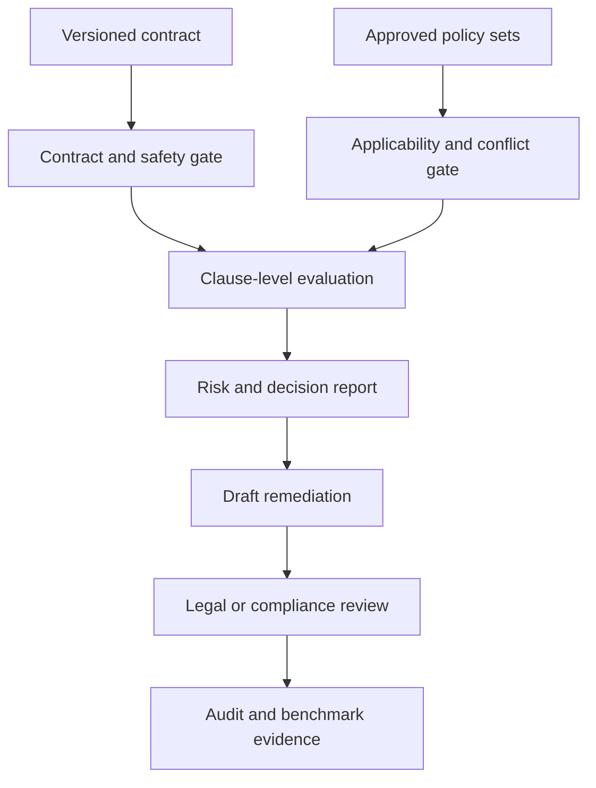

# Project 13 — Contract & Policy Compliance Copilot

A production-oriented, zero-cost decision-support system that compares structured contract clauses with approved, versioned policy rules and produces traceable findings without pretending to replace qualified legal review.

## Business problem

Contract review is slow and inconsistent when reviewers must repeatedly locate missing clauses, prohibited language, liability limits, notice periods, governing law and policy changes. Generic AI summaries can make the problem worse by inventing legal conclusions or hiding their sources. This project makes every finding traceable to an exact contract clause and approved policy rule.

## Architecture



## Implemented evidence

- strict, deterministic contract and policy contracts with unique identities;
- jurisdiction, effective-date, approval-status and policy-version selection;
- explicit blocking when applicable policy rules conflict;
- required-clause, prohibited-phrase, required-term, numeric-limit and allowed-value rules;
- exact citations to policy set, version, rule and contract clause for every compliance finding;
- severity-weighted risk score and compliant, non-compliant, review-required or blocked decisions;
- prompt-injection, secret-pattern, payment-card-shaped data and email scanning;
- draft-only remediation proposals that never modify contract text automatically;
- role-gated legal review for critical and high findings;
- deterministic contract-version diff and report fingerprint;
- benchmark confusion metrics, five inactive n8n workflows, PostgreSQL schema, API, CLI and tests.

## Quick start

```bash
cd 13-contract-policy-compliance-copilot
npm test
npm run demo
npm start
curl http://localhost:8130/health
```

The default Docker path is local and free:

```bash
cp .env.example .env
docker compose up --build
```

## Decision semantics

- `compliant`: no finding exists under the selected approved policies.
- `non_compliant`: only low findings exist.
- `review_required`: a medium/high finding or review-class safety signal needs a qualified reviewer.
- `blocked`: a critical rule, unsafe input, or policy conflict prevents an automated conclusion.

## Evidence and legal boundary

The checked-in contracts, policies and benchmarks are synthetic and labelled `simulated`. They prove the implemented rule engine, citations, decisions and workflow controls. They do not constitute legal advice, prove natural-language extraction quality, or demonstrate performance on customer contracts. The system is decision support; final interpretation and approved redlines remain human responsibilities.

## Documentation

- [Architecture and trust boundaries](docs/architecture.md)
- [Rule and review methodology](docs/compliance-methodology.md)
- [Security and operations](docs/security-and-operations.md)
- [Testing and failure injection](docs/testing.md)

## Known limitations

The reference path evaluates structured clauses and terms rather than extracting them from arbitrary PDFs. Production use needs OCR and layout-aware extraction, clause-classifier calibration, jurisdiction-specific legal ownership, signed policy releases, conflict precedence approved by counsel, privilege and retention controls, tenant isolation, reviewer SLAs, redline integration, multilingual evaluation and human-labelled false-positive/false-negative monitoring.
